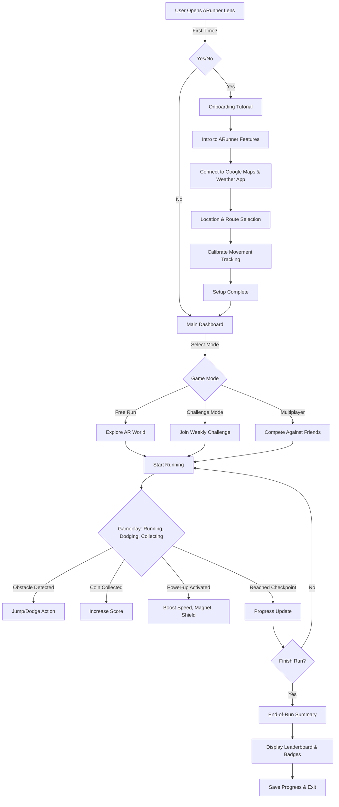
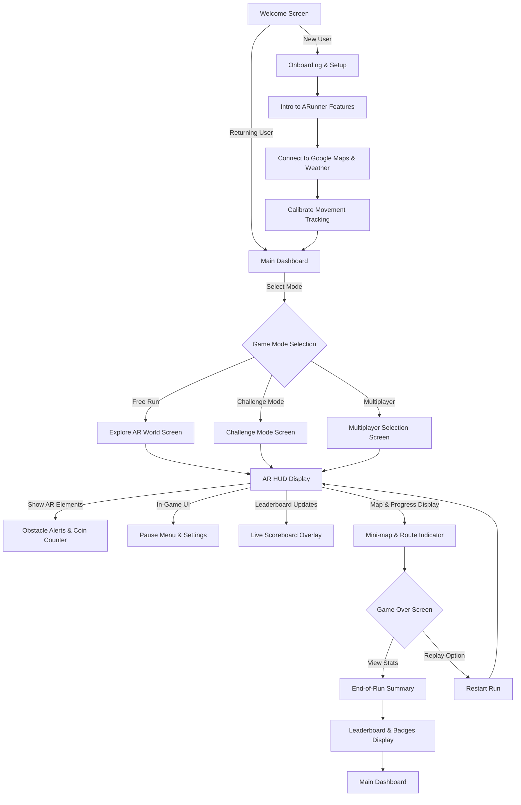
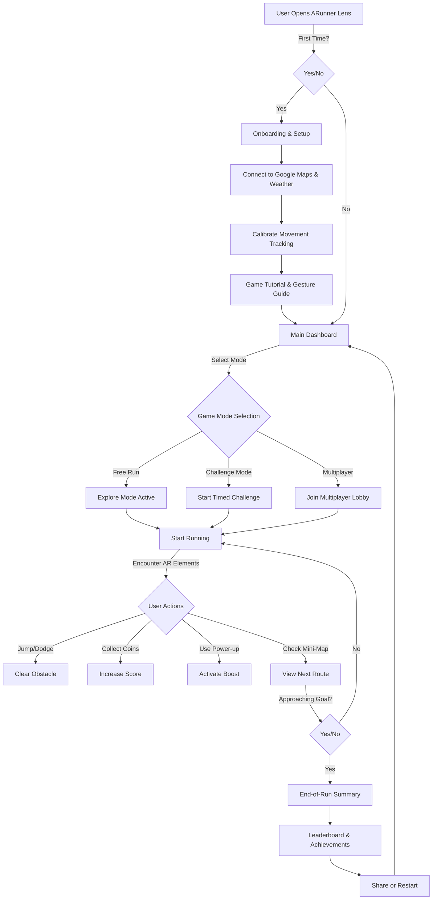
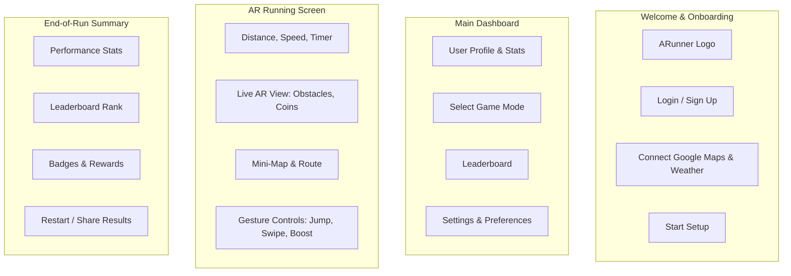

# ARunner
Snapchat SnapAR Spectacles app- ARunner: Race, Dodge, and Explore tracks

# User Flow Diagram
The following diagram represents the user's journey through ARunner:

## **User Flow Breakdown**
1. **First-time users** go through an **onboarding tutorial**, connecting ARunner to Google Maps and the **Weather App** for real-world route generation and weather-based adjustments.
2. After setup, users land on the **Main Dashboard**, where they can choose from:
   - **Free Run** (Explore without challenges)
   - **Challenge Mode** (Timed or goal-based missions)
   - **Multiplayer Mode** (Compete against friends)
3. Once the **run starts**, players encounter:
   - **Obstacles to dodge** (jump, side-step, crouch)
   - **Coins to collect** (boosts leaderboard rank)
   - **Power-ups** (Speed boosts, shields, magnets for more coins)
   - **Dynamic Weather Effects** (Fog, rain, night mode for added challenge)
4. At the **end of the run**, users get a **performance summary**, leaderboard rank, and rewards.
5. Users can **save progress and exit**, keeping them engaged for the next session!

This **user flow** ensures a **seamless experience**, guiding users from **setup to gameplay** while keeping **engagement high** with dynamic challenges and weather-based interactions. 

## **User Journey Breakdown**  

### **1️. First-Time User Experience**  
- **User opens ARunner Lens** for the first time.  
- **Onboarding tutorial** starts, introducing the game concept and mechanics.  
- **User connects to Google Maps & Weather App** to generate a dynamic AR track based on location and real-world conditions.  
- **Calibration setup** ensures accurate movement tracking.  
- **Setup complete → User is taken to the Main Dashboard.**  

### **2️. Returning User Experience**  
- **User logs in and lands on the Main Dashboard.**  
- Can select from:  
  - **Free Run Mode** (Exploring real-world AR obstacles & collectibles).  
  - **Challenge Mode** (Competing in time-based events).  
  - **Multiplayer Mode** (Racing against friends or leaderboards).  
- Game generates a **customized AR track** using Google Maps, Weather API, and previous player data.  
- Countdown timer starts → User begins running.  

### **3️. AR Running Experience**  
- **ARunner overlays interactive elements** in real-world space:  
  - **Obstacles appear dynamically** (jumping over logs, dodging moving cars, avoiding holes).  
  - **Coins & power-ups** are placed along the route for players to collect.  
  - **Weather-based effects** (fog at night, puddles in rain, sun glare).  
  - **Multiplayer ghosts** appear, showing the progress of competing players.  
  - **Leaderboard updates in real-time** as players progress.  
- Players **use hand gestures or movement controls**:  
  - **Swipe to activate power-ups** (e.g., speed boosts, shields).  
  - **Tilt head to dodge objects** or interact with UI.  
  - **Jump or crouch to avoid hazards**.  
- Users reach a **checkpoint** every few minutes, getting progress updates.  

### **4️. End-of-Run & Performance Summary**  
- **User completes their run** or reaches the challenge goal.  
- The **AR-generated leaderboard** displays their ranking.  
- A **performance breakdown** appears:  
  - Distance covered, pace, calories burned.  
  - **Badges unlocked** (e.g., "Longest Run Streak", "Perfect Obstacle Dodge").  
  - **Social challenge prompts** appear (e.g., "Challenge a friend to beat your time!").  
- Option to:  
  - Restart another run.  
  - Share results on Snapchat.  
  - Exit to the dashboard.  

This user journey ensures **seamless onboarding, engaging real-world gameplay, and strong motivation to keep returning** through **leaderboards, social challenges, and gamified fitness tracking.** 

## **UI Structure Diagram** 

### **UI Structure Breakdown**
1. **Welcome Screen:**
   - New users go through onboarding.
   - Returning users land on the main dashboard.

2. **Onboarding & Setup:**
   - Introduction to ARunner's features.
   - Connects to Google Maps & Weather API for real-world track generation.
   - Calibrates movement tracking for accurate AR interactions.

3. **Main Dashboard:**
   - Users select from three game modes:
     - **Free Run:** Open-world AR running.
     - **Challenge Mode:** Time-based obstacle runs.
     - **Multiplayer Mode:** Compete against friends or leaderboard.

4. **Gameplay UI Screens:**
   - **AR HUD Display** shows real-time overlays (distance, pace, time left).
   - **Obstacle Alerts & Coin Counter** provide live updates.
   - **Pause Menu & Settings** allow quick adjustments.
   - **Mini-map & Route Indicator** help users stay on track.

5. **Game Over & End-of-Run UI:**
   - Displays performance, badges, and leaderboard ranking.
   - Provides options to restart a session or exit to the dashboard.

This refined UI structure focuses **only on screen transitions and key UI overlays**, separating **game mechanics from the interface** to clarify how users navigate the Lens.

## **Interactive Flow Diagram** 

### **Interactive Flow Breakdown**
1. **User starts the Lens** and either goes through onboarding or enters the dashboard.
2. **Onboarding covers setup**, including **Google Maps, Weather sync, and movement calibration**.
3. **User selects a game mode** from Free Run, Challenge Mode, or Multiplayer.
4. **During gameplay:**
   - Users **run through AR-enhanced tracks**.
   - Interact via **jumping, dodging, collecting coins, and activating power-ups**.
   - Check the **mini-map for route progress**.
5. **End of session:**
   - **Leaderboard & achievements** displayed.
   - Users can **restart or share their results** before returning to the dashboard.

This **interactive flow diagram** visualizes **decision points and real-time actions** to ensure a **smooth and engaging gameplay experience**.

## **UI Wireframe** 

### **Wireframe Breakdown**
1. **Welcome & Onboarding Screen:**
   - Displays ARunner logo.
   - Login/sign-up options.
   - Connects to Google Maps & Weather API.
   - Starts initial setup.

2. **Main Dashboard:**
   - Shows user profile and past stats.
   - Allows game mode selection.
   - Displays leaderboard.
   - Access to settings & preferences.

3. **AR Running Screen:**
   - Displays speed, distance, and in-game timer.
   - Shows real-time AR obstacles and coins.
   - Mini-map helps users track their route.
   - Gesture-based controls for movement and power-ups.

4. **End-of-Run Summary:**
   - Displays performance metrics.
   - Shows leaderboard ranking.
   - Awards badges for achievements.
   - Provides options to restart or share results.

This Mermaid-based wireframe keeps the structure **clear and modular**, making it easier for the team to visualize the user interface layout. Let me know if you need modifications! 🚀

